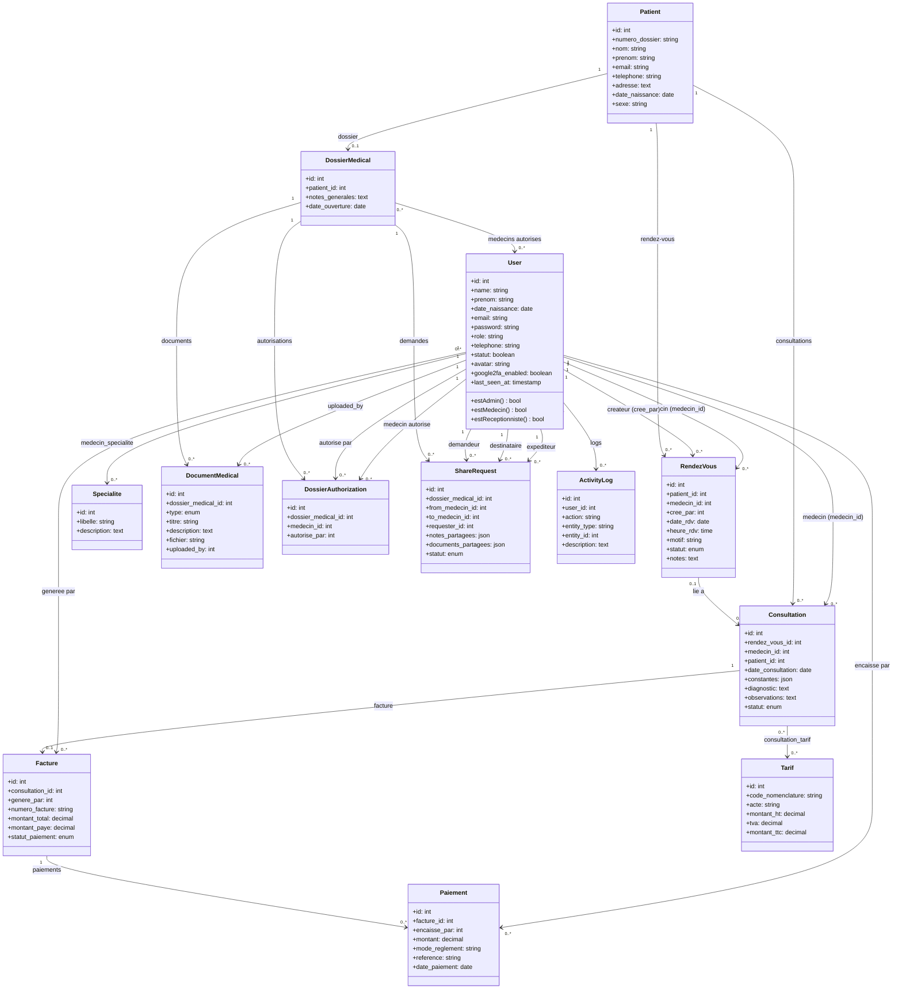

# Diagramme de Classes - Gestion Médicale

```mermaid
classDiagram
    class User {
        +id: int
        +name: string
        +prenom: string
        +date_naissance: date
        +email: string
        +password: string
        +role: string
        +telephone: string
        +statut: boolean
        +avatar: string
        +google2fa_enabled: boolean
        +last_seen_at: timestamp
        +estAdmin() bool
        +estMedecin() bool
        +estReceptionniste() bool
    }

    class Patient {
        +id: int
        +numero_dossier: string
        +nom: string
        +prenom: string
        +email: string
        +telephone: string
        +adresse: text
        +date_naissance: date
        +sexe: string
    }

    class RendezVous {
        +id: int
        +patient_id: int
        +medecin_id: int
        +cree_par: int
        +date_rdv: date
        +heure_rdv: time
        +motif: string
        +statut: enum
        +notes: text
    }

    class Consultation {
        +id: int
        +rendez_vous_id: int
        +medecin_id: int
        +patient_id: int
        +date_consultation: date
        +constantes: json
        +diagnostic: text
        +observations: text
        +statut: enum
    }

    class Facture {
        +id: int
        +consultation_id: int
        +genere_par: int
        +numero_facture: string
        +montant_total: decimal
        +montant_paye: decimal
        +statut_paiement: enum
    }

    class Paiement {
        +id: int
        +facture_id: int
        +encaisse_par: int
        +montant: decimal
        +mode_reglement: string
        +reference: string
        +date_paiement: date
    }

    class Tarif {
        +id: int
        +code_nomenclature: string
        +acte: string
        +montant_ht: decimal
        +tva: decimal
        +montant_ttc: decimal
    }

    class Specialite {
        +id: int
        +libelle: string
        +description: text
    }

    class DossierMedical {
        +id: int
        +patient_id: int
        +notes_generales: text
        +date_ouverture: date
    }

    class DocumentMedical {
        +id: int
        +dossier_medical_id: int
        +type: enum
        +titre: string
        +description: text
        +fichier: string
        +uploaded_by: int
    }

    class DossierAuthorization {
        +id: int
        +dossier_medical_id: int
        +medecin_id: int
        +autorise_par: int
    }

    class ShareRequest {
        +id: int
        +dossier_medical_id: int
        +from_medecin_id: int
        +to_medecin_id: int
        +requester_id: int
        +notes_partagees: json
        +documents_partagees: json
        +statut: enum
    }

    class ActivityLog {
        +id: int
        +user_id: int
        +action: string
        +entity_type: string
        +entity_id: int
        +description: text
    }

    User "1" --> "0..*" RendezVous : medecin (medecin_id)
    User "1" --> "0..*" RendezVous : createur (cree_par)
    User "1" --> "0..*" Consultation : medecin (medecin_id)
    User "1" --> "0..*" Facture : generee par
    User "1" --> "0..*" Paiement : encaisse par
    User "1" --> "0..*" DossierAuthorization : medecin autorise
    User "1" --> "0..*" DossierAuthorization : autorise par
    User "1" --> "0..*" ShareRequest : expediteur
    User "1" --> "0..*" ShareRequest : destinataire
    User "1" --> "0..*" ShareRequest : demandeur
    User "1" --> "0..*" ActivityLog : logs
    User "1" --> "0..*" DocumentMedical : uploaded_by
    User "0..*" --> "0..*" Specialite : medecin_specialite

    Patient "1" --> "0..*" RendezVous : rendez-vous
    Patient "1" --> "0..*" Consultation : consultations
    Patient "1" --> "0..1" DossierMedical : dossier

    RendezVous "0..1" --> "0..1" Consultation : lie a

    Consultation "1" --> "0..1" Facture : facture
    Consultation "0..*" --> "0..*" Tarif : consultation_tarif

    Facture "1" --> "0..*" Paiement : paiements

    DossierMedical "1" --> "0..*" DocumentMedical : documents
    DossierMedical "1" --> "0..*" DossierAuthorization : autorisations
    DossierMedical "1" --> "0..*" ShareRequest : demandes
    DossierMedical "0..*" --> "0..*" User : medecins autorises
```
